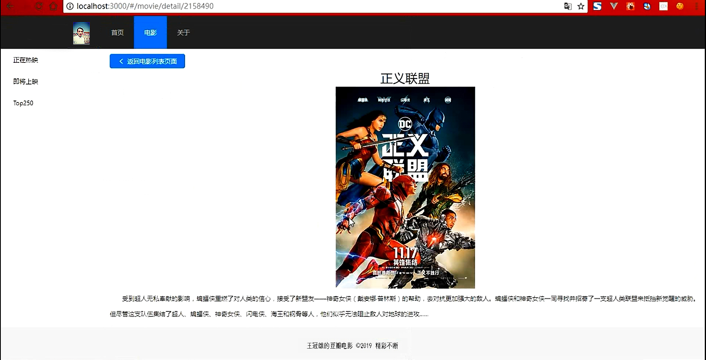

# **my-douban**
-------  
**提醒--豆瓣电影数据常做变动更新，包括它们 的链接和格式，所以本案例不免与目前的格局不一致，由于node_modules等包体积过大---没有上传----下面有曾经的效果图**
-------
## 项目介绍 ：
###    豆瓣电影是一个影视资讯及购票服务网站。
###    展示豆瓣电影提供的电影介绍、电影评论、影讯查询、影院优惠、实时放映时间表等服务功能。中国移动互联网应用类
###    最具创新力。使用React工具及Ant Design of React组件合力完成的项目
------
## 项目职责 ：
###	   使用React工具及Ant Design of React组件合力完成的项目，做好各个组件，与路由和发送请求数据
###	   紧密衔接，动态展示页面
------
## 实现技术 ：React框架/Ant Design组件/
-----
## 项目难点：
###    1、手动搭建平台  +  配置各种工具如jsx / antD/等  + 页面自动打开刷新  +  运行webpack等
###	   2、关于路由的操作(严格匹配和模糊匹配 ，与路由的监听操作 ，和链式编程push的用法)
###	   3、antD的操作使用(按需导入与全部导入及其各自的配置)操作
###	   4、在内容部分有左右两栏，是一路由对一组件，还是多路由对一组件去渲染并返回数据
###    5、关于点击页码页面数据请求并跳转(包括异步跨域发送请求，和响应方法的位置)
###	   6、也许还有未来道路很多的未知问题-但我热爱这行-所以也喜欢它的规矩了 ,写到的不包括全部，咱们面试聊 
-----
## 解决方案 ：
###     1、首先配置环境需要6个步骤，node.js/java jdk/ git / python / c++ / android
###			项目的初始化（期间注意网络的不稳定带来的问题）这些步骤多，需要细心(包括了RN)
###		2、匹配路由时注意exact及参数`（:type/:id）`还有注意寻找它的位置 `this.props.match.params.type`
###			还有关于路径及其寻找重置的方法`（window.location.href= **/ this.props.history.hash等 / ）`
###			可以打印`widow.location`  打印 this  寻找，  还有路由监听处理路由` window.location.path.split("/")[1]，`
###			链式编程就是自动多添加一个路由前的'/#'好处。
###		3、全部导入要注意react中样式模块的书写位置，如果用到样式模块就不要写在webpack配置的css后面，换个
###			scss样式写，导入样式用`{style.color}`样式写，关于样式可以写在行内，可以用Css文件，注意关键字类名
###			全局导入会增加不必要的内存，，而按需导入不用导入类样式但需配置`bable.preset.import`
###			，样式要用{{}}，HTML文件中原始用法就好，在实际开发样式除了100%  还要记得flex:1 的灵活使用
###		4、根据项目的需要在判定使用的方案，如果右侧的格局一样则，可以使用多对一，通过监听dataType来获取发送数据
###			可以使用fetchJSON都是基于promise封装的反之需要一对一组件，---此处注意fetchJSON的使用
###			`fetchJSON('url').then(res=>res.json()).then(data=>在这里操作数据的的组件使用)`
###			此处当注意在实际案例中，常用到生命周期的方法，改变props就用`componentWillReserveProps( nextprops ){}`
###			注意传参数，并且是下一个状态的就是当前要用的参数，然而常常是通过在监听props的变动去改变state的数据
###			也要注意`setState({},function(){这里是异步发送所以响应数据的位置是这里})不能写到外面`
###     5、对于点击当前页码做响应可以用  每页数目*(点击页码数-1)得到每页开始的位置，前提示已经设定好了每页个数等参数
###        再把其拼接到路径中为查询字符串，其次是还要配点击事件，antD插件有相关组件，简单传参，实际开发中
###        会碰到子组件没有history的属性没法用链式 编程，这是就可以用属性传递法，在父级组件去借。
-----
## 项目感受：
###  1、做一个项目难处是要把技术点全部记住，屡清楚做项目的思路。
###	 2、熟悉常用的W3C的规范和标签、样式、让其熟练的在项目中展示，做到孰能生巧，熟悉并优化移
###	 	动端的方案
###	 3、记住JS的常用文档API ，并且要明白DOM、BOM的用处和渲染及一些列的操作，还有一些交互效果，
###	 还有高级的用法，会封装功能组件，模块的调用，也就是面向对象
###	 4、关于JS的一些衍生框架`（Vue.JS / React/JS）`和组件`（Bootstrap.JS / JQuery.JS）`,最后还
###	 有Node.JS/ Ajax.js 等都比较重要
###	 5、还有各框架所用的一些组件Element.UI / JQuery.UI / Mint.UI / zepto.js / Amazing.UI ...
###	 6、移动端有响应式开发 或 混合开发 （从平台搭建到最后打包上线应该有熟练的操作认识）
###	 7、关于一些打包工具Webpack / Gulp ，还有一些的项目保存软件Git与GitHub 或是 常用的SVN的 操作
###	 8、对于制图工具Canvas / Echart.js / Three.js 等也要会用
###	 9、对于WeChat也要会做项目熟练其内部API及一些时间等
###	 10、对齐项目工程化也要了解，这样会提高收索引擎的优化（SEO）

